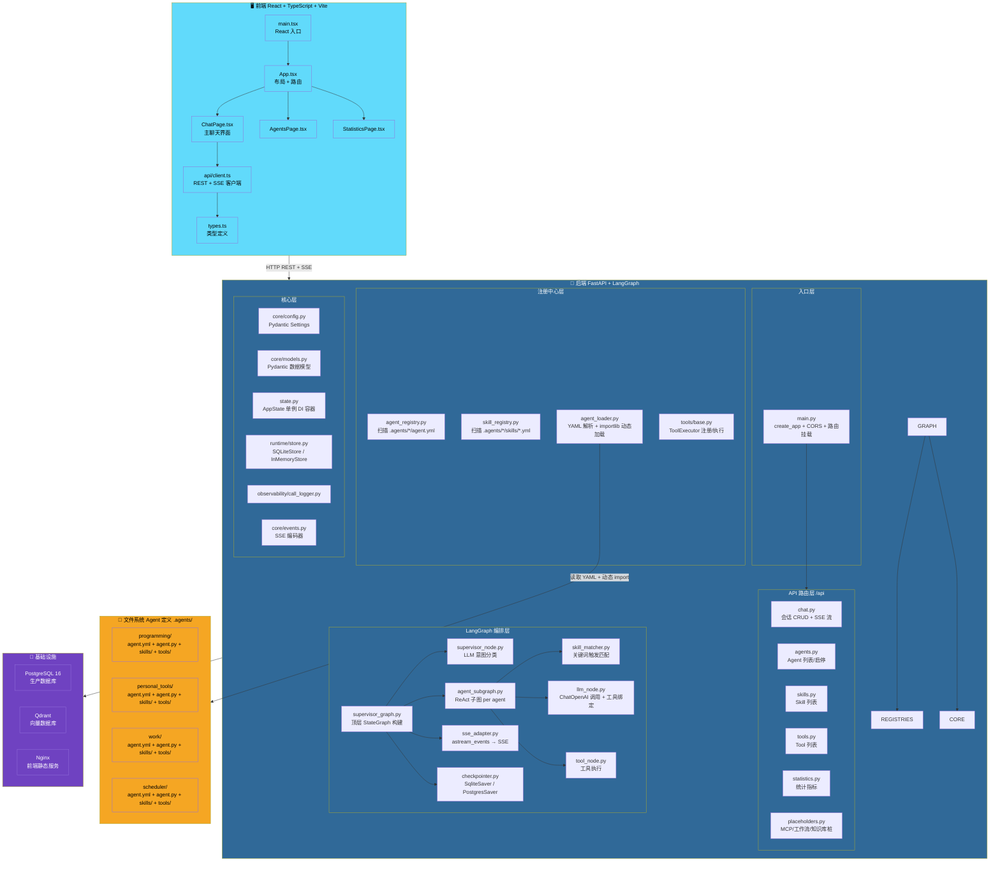

# SelfAgent 架构文档

> 用 Mermaid 描述的项目结构图与运行时流程图，可在支持 Mermaid 的 Markdown 编辑器中直接渲染。

---

## 1. 项目结构图



### 图例

| 颜色 | 区域 | 说明 |
|------|------|------|
| 🟦 蓝色 | 前端 | React SPA，ChatPage → api/client.ts 发起 REST/SSE 请求 |
| 🟦 深蓝 | 后端 | FastAPI + LangGraph，分入口/API/编排/注册中心/核心 5 层 |
| 🟧 橙色 | Agent 定义 | `.agents/` 目录下 YAML 文件，由 agent_loader 动态发现 |
| 🟪 紫色 | 基础设施 | Docker Compose 编排的 PostgreSQL、Qdrant、Nginx |

### 后端分层

| 层级 | 关键文件 | 职责 |
|------|---------|------|
| 入口层 | `main.py` | FastAPI 工厂函数、CORS、路由挂载 |
| API 路由层 | `chat.py`, `agents.py`, `skills.py` 等 | REST 端点 + SSE 流式响应 |
| LangGraph 编排层 | `supervisor_graph.py`, `agent_subgraph.py`, `sse_adapter.py` | 状态图构建、ReAct 循环、事件适配 |
| 注册中心层 | `agent_registry.py`, `skill_registry.py`, `agent_loader.py`, `tools/base.py` | YAML 扫描、动态 import、ToolExecutor |
| 核心层 | `config.py`, `models.py`, `state.py`, `store.py` | 配置、数据模型、DI 容器、持久化 |

---

## 2. 运行时流程图（含代码入口）

```mermaid
sequenceDiagram
    autonumber

    participant User as 👤 用户
    participant Browser as 🌐 ChatPage.tsx
    participant API as 📡 chat.py<br/>send_message()
    participant SSE as 🔄 sse_adapter.py<br/>stream_chat_with_langgraph()
    participant Graph as 🧠 supervisor_graph.py
    participant SupNode as 🎯 supervisor_node.py
    participant SubGraph as 🔁 agent_subgraph.py
    participant LLMNode as 🤖 llm_node.py
    participant ToolNode as 🔧 tool_node.py
    participant Skill as 📋 skill_matcher.py
    participant Tools as ⚙️ tools/base.py<br/>ToolExecutor
    participant Store as 💾 store.py<br/>SQLiteStore
    participant CallLog as 📊 call_logger.py

    %% ===== 启动阶段 =====
    Note over Store,Graph: ═══════ 启动阶段 main.py:create_app() ═══════

    Graph ->> Store: state.py: AppState.__init__()<br/>→ SQLiteStore 初始化
    Graph ->> Graph: agent_loader.py: 扫描 .agents/*/agent.yml<br/>→ AgentRegistry + SkillRegistry
    Graph ->> Tools: agent_loader.py: 动态 import .agents/*/tools/*.py<br/>→ ToolExecutor.register()
    Graph ->> Graph: checkpointer.py: get_checkpointer()<br/>→ SqliteSaver data/checkpoints.db
    Graph ->> Graph: supervisor_graph.py: build_supervisor_graph()<br/>→ 编译 StateGraph state.graph

    Note over Graph: ✅ FastAPI 就绪，监听 http://0.0.0.0:8000

    %% ===== 请求阶段 =====
    Note over User,CallLog: ═══════ 请求处理阶段 ═══════

    User ->> Browser: 输入消息 + 点击发送
    Browser ->> API: POST /api/chat/sessions/&#123;id&#125;/messages<br/>body: &#123; content, agent_name?, workspace_dir &#125;

    API ->> Store: store.get_session(session_id)<br/>获取/创建会话
    API ->> Graph: 构建 initial_state:<br/>messages=[HumanMessage(content)]<br/>+ trace_id, session_id, agent_name...

    API ->> Graph: 构建 RunnableConfig:<br/>configurable=&#123; settings, agent_registry,<br/>skill_registry, tool_executors, store &#125;

    API ->> SSE: stream_chat_with_langgraph(graph, state, config)

    %% ===== SSE 流式阶段 =====
    Note over SSE,CallLog: ═══════ SSE 流式处理阶段 ═══════

    SSE ->> Browser: event: supervisor_started<br/>data: &#123;"type":"supervisor_started",...&#125;

    SSE ->> Graph: graph.astream_events(initial_state, config, version="v2")

    rect rgb(255, 245, 220)
        Note over Graph: Step 1: 监督者路由节点

        Graph ->> SupNode: supervisor_node:<br/>LLM 分析用户意图

        alt 手动指定了 agent_name
            SupNode ->> SupNode: route_decision = &#123;<br/>agent_name: requested_agent,<br/>source: "manual" &#125;
        else LLM 意图分类
            SupNode ->> SupNode: ChatOpenAI(deepseek-chat)<br/>JSON response_format<br/>→ &#123;"agent":"programming",<br/>   "confidence":0.95, "intent":"...",<br/>   "reason":"...", "source":"llm"&#125;
        else LLM 失败降级
            SupNode ->> SupNode: keyword_match(user_input):<br/>"git"→programming,<br/>"pdf"→personal_tools,<br/>"日报"→work, "提醒"→scheduler
        end

        SupNode ->> Graph: 返回 &#123; route_decision &#125;

        SSE ->> Browser: event: agent_started<br/>data: &#123;"type":"agent_started",<br/>  "agent_name":"programming",...&#125;
    end

    rect rgb(230, 245, 230)
        Note over Graph: Step 2: Agent 子图 ReAct 循环

        Graph ->> SubGraph: 进入 agent_subgraph 如 programming

        SubGraph ->> Skill: skill_matcher: 关键词触发匹配
        Skill ->> Skill: SkillRegistry.match_skills(<br/>  "programming", user_input)
        loop 每个匹配的 skill
            SSE ->> Browser: event: skill_activated<br/>data: &#123;"type":"skill_activated",<br/>  "skill_name":"git-manager",...&#125;
        end

        loop ReAct 循环 有 tool_calls 时继续
            SubGraph ->> LLMNode: llm_node: 调用 ChatOpenAI
            LLMNode ->> LLMNode: 构建 system_prompt + messages<br/>绑定 ToolExecutor.openai_tool_definitions()
            LLMNode ->> LLMNode: model.astream(messages, tools=...)
            LLMNode -->> SSE: on_chat_model_stream →<br/>event: answer_delta
            SSE -->> Browser: data: &#123;"type":"answer_delta",<br/>  "delta":"..."&#125;

            alt AI 决定调用工具
                LLMNode ->> SubGraph: AIMessage(tool_calls=[...])
                SubGraph ->> ToolNode: tool_node: 执行工具调用

                loop 每个 tool_call
                    SSE ->> Browser: event: tool_started<br/>data: &#123;"tool_name":"git_status",...&#125;
                    ToolNode ->> Tools: ToolExecutor.execute(<br/>  "git_status", arguments)
                    Tools ->> Tools: asyncio.wait_for(<br/>  tool_func(**args, workspace_dir=...),<br/>  timeout=30s)
                    Tools -->> ToolNode: ToolResult(success=True,<br/>  output="On branch main\n...")
                    ToolNode ->> SubGraph: ToolMessage(content=output)
                    SSE ->> Browser: event: tool_result<br/>data: &#123;"tool_name":"git_status",<br/>  "result_preview":"On branch main..."&#125;
                end

                SubGraph ->> LLMNode: 循环回到 llm_node<br/>带工具执行结果
            else 无 tool_calls
                LLMNode ->> SubGraph: AIMessage(content=最终答案)
                Note over SubGraph: ReAct 循环结束
            end
        end
    end

    Graph -->> SSE: astream_events 完成
    SSE ->> Store: store.add_message(session_id,<br/>  ChatMessage(role="assistant",...))
    SSE ->> CallLog: call_logger.log(CallLog(<br/>  trace_id, agent, status=success,...))
    SSE ->> Browser: event: final<br/>data: &#123;"type":"final",<br/>  "answer":"完整回答...",<br/>  "agent_used":"programming",...&#125;

    Browser ->> Browser: React setState → 更新消息列表<br/>渲染 assistant bubble + 内联事件时间线

    Note over User,CallLog: ✅ 一次完整的请求处理结束
```



### 代码入口速查

| 阶段 | 入口文件 | 入口函数/类 | 说明 |
|------|---------|------------|------|
| 后端启动 | `main.py` | `create_app()` | FastAPI 工厂函数，初始化所有组件 |
| DI 容器 | `state.py` | `AppState.__init__()` | 初始化 Store、Registry、Graph、ToolExecutor |
| Graph 构建 | `supervisor_graph.py` | `build_supervisor_graph()` | 编译 LangGraph StateGraph |
| 前端启动 | `main.tsx` | `ReactDOM.createRoot()` | React SPA 入口 |
| 聊天请求 | `chat.py` | `send_message()` | POST SSE 流式端点 |
| SSE 适配 | `sse_adapter.py` | `stream_chat_with_langgraph()` | astream_events → SSE 事件桥接 |
| 意图路由 | `supervisor_node.py` | `supervisor_node()` | LLM 分类 / 关键词降级 |
| Agent 循环 | `agent_subgraph.py` | `build_agent_subgraph()` | ReAct 子图：Skill → LLM ⇄ Tool |
| 前端发送 | `ChatPage.tsx` | `send()` | 调用 `api/client.ts:streamMessage()` |

### SSE 事件流时序

```
supervisor_started → agent_started → skill_activated* → answer_delta* → tool_started* → tool_result* → final
                                                                         ↑______________↓ (循环)
```
- `*` 表示可能多次出现
- `tool_started` / `tool_result` 成对出现，在 ReAct 循环中与 `answer_delta` 交替

### 关键设计决策

| 决策 | 说明 |
|------|------|
| **DeepSeek 作为 LLM** | 通过 OpenAI 兼容接口 (`ChatOpenAI` + `base_url`) 调用 DeepSeek |
| **文件系统驱动注册** | Agent/Skill 定义全部来自 `.agents/` 目录下的 YAML 文件，无需数据库 |
| **LangGraph 替代旧 Runtime** | `AgentRuntime` 已废弃，改用 `StateGraph` + `astream_events` + `SqliteSaver` |
| **SSE 替代 WebSocket** | 选择 SSE 实现流式响应，前端用 `fetch` + `ReadableStream` 接收 |
| **无认证 MVP** | 当前版本无认证机制，仅靠 CORS 和环境变量保护 |
| **工作区隔离** | 每个 `ToolExecutor` 有独立的 `workspace_dir` 和 `allowed_paths` |
